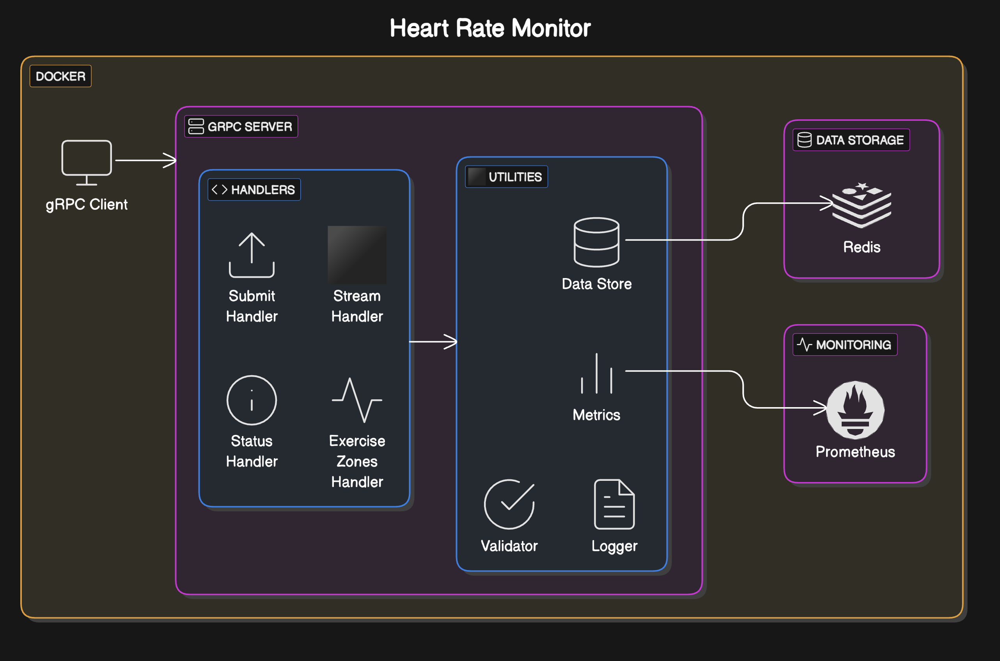

# Heart Rate Monitoring Service

## Overview

This Python project implements a service that processes heart rate data, validates it, generates alerts based on thresholds, and logs events appropriately. The service is defined using Protocol Buffers and provides four main endpoints.

## System Architecture



## Features

- **Submit Heart Rate**: Submit a single heart rate measurement
- **Stream Heart Rate**: Stream heart rate measurements and receive immediate feedback
- **Get Heart Rate Status**: Get the current status of heart rate monitoring
- **Calculate Exercise Zones**: Analyze heart rate data to calculate time spent in different exercise zones


## Repository Structure

```
.
├── src/               # Main application code
│   ├── server.py      # gRPC server implementation
│   ├── client.py      # gRPC client implementation
│   ├── handlers/      # Request handlers
│   └── utils/         # Utility functions
│       ├── data_store.py  # Redis data storage
│       ├── logger.py      # Logging utilities
│       ├── metrics.py     # Prometheus metrics
│       └── validator.py   # Heart rate validation
├── proto/             # Protocol Buffers definitions
│   └── heartrate_service.proto
├── tests/             # Test files
│   ├── unit/          # Unit tests
│   ├── integration/   # Integration tests
│   └── perf/          # Performance tests
├── scripts/           # Helper scripts
│   ├── build.sh       # Generate Proto files
│   ├── setup.sh       # Install dependencies
│   ├── run.sh         # Run server or client
│   ├── test.sh        # Run tests
│   ├── check-ports.sh # Port availability checker
│   └── validate.sh    # Complete validation workflow
├── Dockerfile         # Docker image definition
├── docker compose.yml # Multi-container configuration
├── Makefile           # Convenient commands
└── requirements.txt   # Python dependencies
```

## Running the Application

### Option 1: Using Scripts (Local Setup)

1. **Create a virtual environment**:
   ```bash
   python3 -m venv .venv
   source .venv/bin/activate  # On Windows: .venv\Scripts\activate
   ```

2. **Install dependencies**:
   ```bash
   pip install -r requirements.txt
   ```

3. **Generate Protocol Buffers files**:
   ```bash
   ./scripts/build.sh
   ```

4. **Install Redis** (required for data storage):
   ```bash
   # On macOS with Homebrew
   brew install redis
   brew services start redis

   # On Ubuntu/Debian
   sudo apt-get install redis-server
   sudo systemctl start redis-server
   ```

5. **Run the server**:
   ```bash
   ./scripts/run.sh server
   # Or directly with Python:
   python -m src.server
   ```

6. **Run the client** (in another terminal):
   ```bash
   ./scripts/run.sh client
   # Or directly with Python:
   python -m src.client
   ```

7. **Run tests**:
   ```bash
   ./scripts/test.sh
   # Or directly with Python:
   python -m unittest discover tests
   ```

### Option 2: Using Docker (Recommended)

This project can be run using Docker and Docker Compose, which simplifies setup and ensures consistent environments.

#### Prerequisites

- [Docker](https://docs.docker.com/get-docker/)
- [Docker Compose](https://docs.docker.com/compose/install/)

#### Running with Docker

1. **Build the Docker images**:
   ```bash
   make build
   ```

2. **Start the service**:
   ```bash
   make up
   ```
   This starts both the Redis server and the Heart Rate Monitoring service.

3. **Run the client**:
   ```bash
   make client
   ```

4. **Run tests**:
   ```bash
   make test
   ```

5. **Stop the service**:
   ```bash
   make down
   ```

#### Build and Test Workflow

To ensure code quality, the project includes a build-and-test workflow:

1. **Build and automatically run tests**:
   ```bash
   make build-and-test
   ```

2. **Run complete Docker validation** (recommended before commits):
   ```bash
   make validate
   ```
   This performs a comprehensive validation of your Docker setup including:
   - Building fresh images
   - Checking for port conflicts
   - Running service health checks
   - Running all unit and integration tests

#### Useful Docker Commands

- **View logs**:
  ```bash
  make logs
  ```

- **View logs for a specific service**:
  ```bash
  make logs-service  # Heart rate service logs
  make logs-redis    # Redis logs
  ```

- **Restart services**:
  ```bash
  make restart
  ```

- **Clean up resources**:
  ```bash
  make clean
  ```

- **Check port availability**:
  ```bash
  make ports
  ```

- **Run specific test suites**:
  ```bash
  make test-unit        # Run only unit tests
  make test-integration # Run only integration tests
  make test-performance # Run performance tests
  ```

### Port Configuration

The service uses the following ports by default:
- **50051**: gRPC server
- **8080**: Prometheus metrics
- **6379**: Redis

The application automatically handles port conflicts when you run `make up` or `make build-and-test`. If any required ports are in use, you'll be presented with interactive options:

1. **Free the ports** - This will attempt to kill processes using the conflicted ports
2. **Use alternative ports** - This will automatically switch to alternative ports (50052, 8081, 6380)
3. **Cancel operation** - This will abort the startup process

You can also directly specify custom ports by setting environment variables:

```bash
GRPC_PORT=50060 METRICS_PORT=8090 REDIS_PORT=6390 make up
```

## Core Components

### Heart Rate Validation

The service uses a dedicated validator module (`src/utils/validator.py`) to validate heart rate measurements:

- **Valid heart rate range**: 40-180 BPM
- **Normal heart rate range**: 50-150 BPM
- **Low heart rate alert**: 40-49 BPM
- **High heart rate alert**: 151-180 BPM

### Data Storage

Heart rate data is stored in Redis, providing:
- Fast in-memory operations
- Built-in time-series capabilities
- Support for atomic operations

### Metrics and Monitoring

The service exposes metrics via Prometheus for:
- Request count and latency
- Error rates
- Redis operation metrics
- Alert frequency

## API Reference

The service provides the following gRPC endpoints:

- `SubmitHeartRate(HeartRateRequest) returns (HeartRateResponse)`
- `StreamHeartRate(stream HeartRateRequest) returns (stream HeartRateResponse)`
- `GetHeartRateStatus(StatusRequest) returns (StatusResponse)`
- `CalculateExerciseZones(ExerciseZoneRequest) returns (ExerciseZoneResponse)`

For detailed API documentation, see the Proto file: `proto/heartrate_service.proto`

## On-the-Fly Generated Directories

During runtime, the application dynamically creates the following directories:

- **`generated/`**: Stores files generated from Protocol Buffers definitions. These files are essential for gRPC communication and are recreated whenever the Proto files are updated.

- **`log/`**: Contains the `server.log` file, which records significant events with a log level of `WARN` or higher. The log file is managed with a rotation policy, ensuring a new log file is created every 7 days to maintain readability and manage disk space efficiently.

Both directories are automatically created and managed by the application, requiring no manual intervention.

## Design Choices

1. **Modular Architecture**: The codebase follows a modular design with separate components for protocol definitions, server implementation, request handlers, and utilities.

2. **Redis for Data Storage**: Selected for its speed and suitability for time-series data. Redis object instantiation follows Lazy Singleton Design Pattern

3. **Prometheus for Metrics**: Enables real-time visibility into the system's performance and health.

4. **Centralized Validation**: Dedicated validator module ensures consistent data validation across all endpoints.


## Testing Stratgy

1. **Unit Tests**: Located in tests/unit. Each RPC handler has a corresponding test file. Uses mocks to isolate business logic.

2. **Integration Tests**: Located in tests/integration. Spins up a local gRPC server in-process and tests end-to-end functionality.

3. **Performance/Load Tests**: Located in tests/perf. Includes benchmarks for unary RPCs and load tests for streaming endpoints.

4. **Continuous Testing**: A scripts/test.sh file runs all tests sequentially. Integrated into the CI/CD pipeline via Docker Compose.

## Potential Improvements

1. **Authentication and Authorization**: Add user authentication and authorization for API security
2. **CI/CD Pipeline**: Expand the existing CI/CD pipeline to incorporate advanced automated testing, streamlined deployment workflows, and support for multiple environments. The current pipeline, defined in `.github/workflows/ci.yml`, performs basic validation of source code pushed to GitHub. Enhancements could include integration tests, performance benchmarks, and deployment to staging or production environments.
3. **Testing Strategy**: Strengthen the testing framework by increasing unit and integration test coverage. Incorporate diverse scenarios, including unary and streaming gRPC calls, and introduce load and stress testing to evaluate system performance under high demand.
4. **Data Retention and Log Rotation Policies**: Introduce configurable data retention policies for heart rate measurements, allowing users to define retention periods based on their needs. Additionally, implement log rotation based on file size thresholds to ensure efficient disk space management and prevent excessive log growth.
5. **Dashboard**: Develop an interactive web dashboard for visualizing heart rate data, leveraging tools like Grafana for seamless integration with Prometheus metrics.
6. **Memory Profiling**: Integrate Python's built-in memory profiling tools, such as `tracemalloc` or `memory_profiler`, to identify and address memory bottlenecks, ensuring optimal resource utilization.
7. **Mobile Client**: Build a cross-platform mobile application to enable real-time heart rate monitoring and alerts on the go.

## Assumptions

1. The typical BPM range for adults is 40–180; values outside this range are considered invalid.
2. Redis is used as the primary data store, and it is expected to be running (locally or in Docker).
3. The calculation formulas used in CalculateExerciseZonesHandler are simplified and may differ from standard exercise zone calculation methods (e.g., the Karvonen formula or percentage-based methods using Max HR). Future iterations might align these calculations more closely with industry standards.
4. The service handles up to 10 requests per second for unary calls and supports at least 5 concurrent streaming clients (Tested and verified with tests/perf)
5. The logging configuration writes to a file with rotation, and the generated directory for protobuf files is recreated whenever the definitions change.

## Development Workflow

This project follows a test-driven development approach:

1. **Write tests** for new features or bug fixes
2. **Implement the changes**
3. **Run `make build-and-test`** to ensure your changes work and don't break existing functionality
4. **Run `make validate`** to perform a complete validation of your Docker setup
5. **Commit your changes** only if all validations pass
